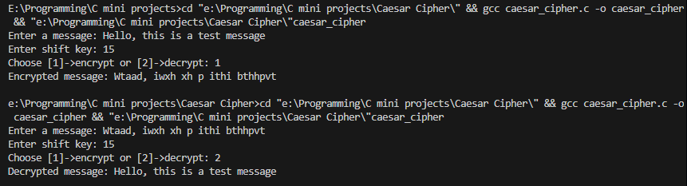

### Caesar Cipher (C Implementation)

A simple Caesar Cipher tool written in C that allows users to encrypt or decrypt text using a shift key.

# Features
- Encrypt messages with a user-defined shift key
- Decrypt messages back to original text
- Handles both uppercase and lowercase letters

# Usage
- Enter a message to encrypt/decrypt
- Provide a shift key (integer)
- Choose whether to encrypt or decrypt

