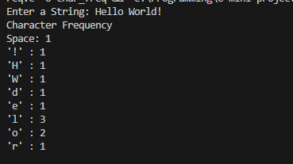

### Character Frequency Counter

A simple character frequency counter that:
- Counts how many times each character appears in a string.
- Supports all ASCII characters (letters, digits, symbols, spaces, etc.).
- Displays results clearly, including non-printable characters as ASCII code.

